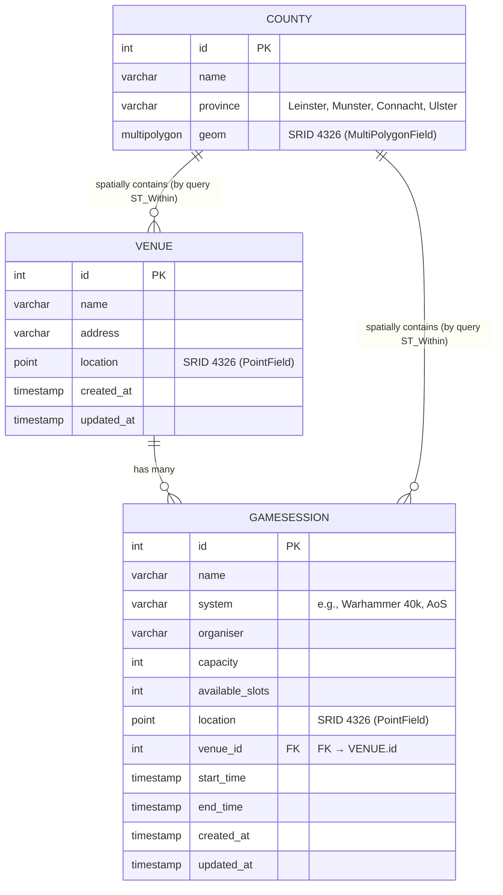
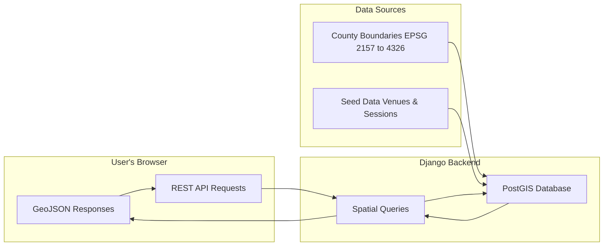

# Application Description

**Warhammer Game Finder** is a **location-based web mapping application** built with **Django**, **PostGIS**, and **Leaflet.js**.  
It enables players to **discover and explore nearby Warhammer game sessions** and **venues across Ireland** using real-world spatial data and interactive map-based searches.

The system integrates **GeoDjango**, **RESTful APIs**, and **Leaflet visualisation** in a full-stack GIS environment.  
It implements **three core spatial workflows**, each powered by PostGIS:

- **Nearest Me Search**: Finds the 10 closest sessions using `ST_Distance`.  
- **Area Search (Bounding Box)**: Displays sessions within the current map view using `ST_Within`.  
- **Province Filter (Point-in-Polygon)**: Filters sessions inside county polygons and groups them by province.

---

## Features Overview

### Interactive Map & User Interface
- Fully interactive **Leaflet** map with pan, zoom, and dark-themed styling.  
- Real-time updates as filters or searches are applied.  
- Responsive layout with a dynamic sidebar for results and filters.  
- Each result card displays session details, venue name, and distance (if current location is known).  
- Floating map buttons for:
  - *Find Nearest Sessions*  
  - *Search in Current Area*  

---

### Spatial Search & Filtering
- **Nearest Search**: Uses `ST_Distance` to find sessions closest to the user.  
- **Bounding Box Search**: Returns sessions within the map’s visible extent.  
- **Province Filter**: Matches session or venue coordinates within county polygons via `ST_Within`, `ST_CoveredBy`, and `ST_Intersects`.  
- **Keyword Search**: Filter sessions by name, description, venue, or system.  
- **Game System Dropdown**: Dynamically lists all distinct systems (e.g. *Warhammer 40k*, *Age of Sigmar*, ...).  
- **Open Session Toggle**: Filters to only include sessions with available slots.

---

### Data Layers & Structure
- **Venues**: Point data representing real-world gaming stores or clubs.  
- **Game Sessions**: Spatial points containing attributes such as system, organiser, and capacity.  
- **Counties**: MultiPolygon dataset from the **OSi National Statutory Boundaries**, transformed from **EPSG:2157 to 4326** on import.  
- All geometry fields use **SRID 4326 (WGS84)** and are **spatially indexed** for optimal performance.

---

### API & Backend Integration
- **Django REST Framework + rest_framework_gis** provide GeoJSON-ready endpoints:  
  | Endpoint | Description |
  |-----------|-------------|
  | `/api/sessions/geojson/` | Returns filtered session data as GeoJSON |
  | `/api/sessions/nearest/` | Finds sessions nearest to a coordinate |
  | `/api/sessions/in-bbox/` | Sessions within current map bounds |
  | `/api/counties/for-point/` | Returns the county containing a given point |
  | `/api/counties/distinct-provinces/` | Lists all available provinces |
- All endpoints return **GeoJSON FeatureCollections** directly compatible with Leaflet.

---

### Data Management & Admin Tools
- County polygons are imported via the custom `load_counties` management command.  
- Automatically clears existing entries to prevent duplicates.  
- **Django Admin** is configured with `OSMGeoAdmin`:
  - Maps centre on Dublin by default.  
  - Session entries inherit venue coordinates automatically.  
  - Allows full visual editing of spatial data.  
  
## Database Schema




---

### Architecture & Performance
- Follows Django’s **MVC structure** (`models`, `views`, `serializers`).  
- **PostGIS** used for all spatial queries and indexing.  
- **Asynchronous `fetch()` requests** ensure fast, seamless map updates.  
- Modular design supports future expansion with minimal refactoring.  


## System Architecture




---

# Demo Screenshots
**Interactive Leaflet map with sessions and venues displayed:**


**Nearest sessions located using browser geolocation:**


**Sessions filtered by county/province boundaries:**


---


# Setup Instructions

### 1. Clone the Project
```bash
git clone <repo-url>
cd warhammer-game-finder
```

### 2. Create & Activate Virtual Environment
```bash
python -m venv venv
source venv/bin/activate 
```

### 3. Install Python Dependencies
```bash
pip install -r requirements.txt
```

### 4. Install PostgreSQL + PostGIS
```bash
sudo apt install postgresql postgis
```

### 5. Create the Database & Enable PostGIS
```bash
sudo -u postgres createdb wh_game_finder
sudo -u postgres psql -d wh_game_finder -c "CREATE EXTENSION postgis;"
```

### 6. Apply Migrations
```bash
python manage.py migrate
```

---

## Spatial Data Setup

### County & Province Boundaries
This project uses the **OSi National Statutory Boundaries** dataset:  
https://data-osi.opendata.arcgis.com/

The data is provided in **EPSG:2157 (Irish Transverse Mercator)** and is automatically reprojected to **EPSG:4326 (WGS84)** during import.

Import the county polygons:
```bash
python manage.py load_counties path/to/county_shapefile.shp
```

This:
- Clears existing records  
- Converts geometry to SRID 4326  
- Stores polygons in the database  
- Links each county to its province  

---

### Seed Venues & Example Sessions
```bash
python manage.py seed_data
```

Loads:
- **Venues** (shops/gaming clubs)
- Sample **Game Sessions** linked to those venues

---

## Run the Application
```bash
python manage.py runserver
```

Open in browser:
**http://127.0.0.1:8000/**


# Technology Stack

### Backend
- **Django**: Core web framework (MVC pattern)
- **GeoDjango**: Spatial support layer integrated into Django ORM
- **Django REST Framework**: API layer
- **rest_framework_gis**: GeoJSON responses for Leaflet compatibility

### Geospatial Database
- **PostgreSQL**: Relational database
- **PostGIS**: Extension enabling spatial columns, indexes, and queries  
  - Used for: `ST_Distance`, `ST_Within`, `ST_Intersects`, bounding box filters, nearest search

### Frontend & Mapping
- **Leaflet.js**: Interactive map visualisation library  
  - Supports markers, popups, map interactions, and tiled basemap layers
- **OpenStreetMap Tile Layers**: Default basemap
- **JavaScript + Fetch API**: Dynamic map updates via REST API calls

### Data Formats & Standards
- **GeoJSON FeatureCollections**: Returned from API, consumed directly by Leaflet
- **WGS84 / EPSG:4326**: Standard coordinate reference system used throughout
- **OSi National Statutory Boundaries**: County & province polygons dataset

### Development Environment
- **Python 3.10+**
- **IDE*: VS Code
- **GDAL / GEOS / PROJ**: Required spatial libraries (installed via system packages)


# Known Issues / Limitations

- **Location Accuracy Depends on Browser Permissions**  
  The “Nearest Sessions” feature uses the browser’s geolocation API.  
  If permission is denied or unavailable, nearest searches fall back to a default centre point (Dublin).

- **County Shapefile Must Be Supplied Manually**  
  The OSi boundary dataset is not included with the source code due to licensing restrictions.  
  Users must download it and run `load_counties` before spatial filtering works.

- **Seed Data Is Demo-Only**  
  The example venues and sessions are provided for testing and demonstration.  
  Real deployments should replace these with actual club/store data.

- **No User Authentication System Yet**  
  All searches and map interactions are currently visible to the public.  
  Future versions may include user accounts, session management, and submission forms.


# API Documentation

All API responses are returned as **GeoJSON FeatureCollections** and are designed to be consumed directly by **Leaflet.js**.

### Base URL
```
/api/
```

### Endpoints

| Endpoint | Method | Description | Returns |
|---------|--------|-------------|---------|
| `/api/sessions/geojson/` | GET | List all sessions, with optional filters (system, keywords, availability) | GeoJSON (points) |
| `/api/sessions/nearest/?lat=<>&lng=<>` | GET | Returns the nearest 10 sessions to a given coordinate | GeoJSON (points + distance) |
| `/api/sessions/in-bbox/?bbox=<west,south,east,north>` | GET | Returns sessions inside the map’s current bounding box | GeoJSON (points) |
| `/api/counties/for-point/?lat=<>&lng=<>` | GET | Returns the county polygon containing a point | GeoJSON (polygon) |
| `/api/counties/distinct-provinces/` | GET | Lists all provinces known to the dataset | JSON (list of names) |

### Geometry & Coordinate System
- All geometries use **EPSG:4326 (WGS84)** 

- Coordinates are expressed as **longitude, latitude**

### Example Response (Sessions)
```json
{
  "type": "FeatureCollection",
  "features": [
    {
      "type": "Feature",
      "geometry": { "type": "Point", "coordinates": [-6.2603, 53.3498] },
      "properties": {
        "name": "40k Casual Night",
        "venue": "Dice & Pixels Dublin",
        "system": "Warhammer 40k",
        "organiser": "John Doe",
        "capacity": 6,
        "available_slots": 2
      }
    }
  ]
}
```

These endpoints are used directly by the Leaflet map via the JavaScript `fetch()` API.
